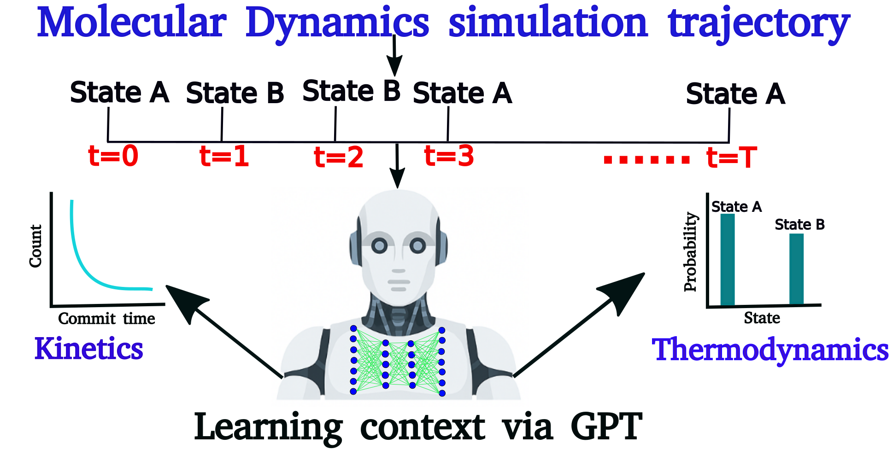
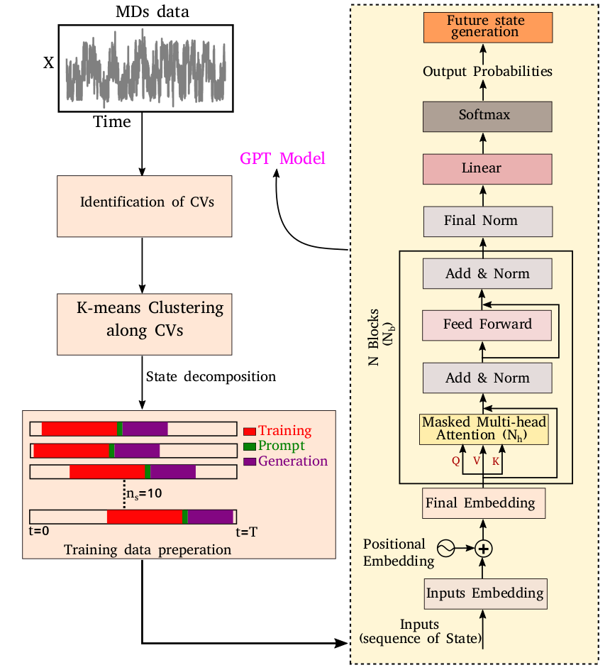

# Generative Pre-trained Transformer model for future state prediction

Welcome to the repository for the research project titled **"Accurate Prediction of the Kinetic Sequence of Physicochemical States Using Generative Artificial Intelligence"**

# Abstract
**Capturing the time evolution and predicting kinetic sequences of states of physicochemical systems present significant challenges due to the precision and computational effort required. In this study, we demonstrate that Generative Pre-trained Transformer (GPT), an artificial intelligence model renowned for machine translation and natural language processing, can be effectively adapted to predict the dynamical state-to-state transition kinetics of biologically relevant physicochemical systems. Specifically, by using sequences of time-discretized states from Molecular Dynamics (MD) simulation trajectories akin to vocabulary corpus of a language, we show that a GPT-based model can learn the complex syntactic and semantic relationships within the trajectory. This enables GPT to predict kinetically accurate sequences of states for a diverse set of biomolecules of varying complexity, at a much quicker pace than traditional MD simulations and with a better efficiency than other base-line time-series prediction approaches. More significantly, the approach is found to be equally adept at forecasting the time evolution of out-of-equilibrium active systems that do not maintain detailed balance. An analysis of the mechanism inherent in GPT reveals crucial role of `self-attention mechanism' in capturing the long-range correlations necessary for accurate state-to-state transition predictions. Together, our results highlight the generative artificial intelligence’s ability to generate kinetic sequence of states of physicochemical systems with statistical precision.**

# Graphical Abstract

This implementation of the GPT model has been adapted from the following GitHub page: [Infatoshi/fcc-intro-to-llms](https://github.com/Infatoshi/fcc-intro-to-llms).

# A schematic representation of training data preparation and the architecture of the decoder-only transformer.

The left-hand side figure represents the schematic representation of the discretization of molecular dynamics simulation (MDs) trajectory achieved through the identification of collective variables (CVs) and K-means clustering. A total of $n_s = 10$ segments are randomly selected from the discretized trajectory to train an equal number of independent generative pre-trained transformer (GPT) models. Each trained model generates subsequent sequences starting from where the respective segment ended, using a few sequences as prompts. The right-hand side figure depicts the various layers of a decoder-only transformer. The model architecture consists of input embedding, positional embeddings, and multiple blocks of masked multi-head attention, normalization, and feed-forward layers.

# Code Requirements

Ensure you have the following Python packages installed to run the code:

1. [numpy](https://numpy.org/)
2. [tensorflow](https://www.tensorflow.org/)
3. [PyTorch](https://pytorch.org/)

# Package version
1. Python (3.11.5)
2. Numpy  (1.26.4)
3. PyTorch (2.2.0)
4. Tensorflow (2.15.0)

# How to run the code

There are mainly two folders, `autoencoder` and `gpt_model`, which contain their corresponding code for training the model. For `gpt_model`, the data for all of the systems are provided. The folder contains the data for training, validation, and generation. After completion of the training by running the Python scripts `train_gpt_model.py`, one can generate as many sequences as possible by running the Python script `inference.py`.

## News!
Publication Alert 🚀

This work is now published in **Chemical Science**!🎉

🔍 Key Findings:

- Our study presents a novel application of the transformer model, a deep learning architecture that has revolutionized natural language processing, to the domain of molecular dynamics (MD) simulations. Specifically, we utilize the Generative Pre-trained Transformer (GPT) to predict the future states of molecular trajectories, offering a powerful tool for exploring the kinetics as well as thermodynamics of physicochemical systems.
- Our study significantly expands the scope to tackle systems of greater complexity, ranging from simple multi-state models to challenging biomolecular systems like the Trp-cage protein, intrinsically disordered protein α-Synuclein, and an active, out-of-equilibrium polymer system.
- By utilizing the self-attention mechanism of GPT, our model effectively captures the intricate syntactic and semantic relationships inherent in MD trajectories. This capability enables accurate prediction of future states with both kinetic and thermodynamic fidelity, even for complex systems. Our results also reveal that the self-attention mechanism plays a crucial role in capturing long-range dependencies, which are essential for precise state-to-state transitions.
- We conducted rigorous comparisons with traditional Markov State Models (MSMs) and language model such as LSTM networks, demonstrating that GPT consistently outperforms these methods in prediction accuracy. This advancement shows GPT’s ability to address key limitations of existing methods and speed up predictions in MD simulations.

📖 Check out the full study [here](https://pubs.rsc.org/en/Content/ArticleLanding/2025/SC/D5SC00108K) for more insights!

Stay tuned for more exciting updates!  

